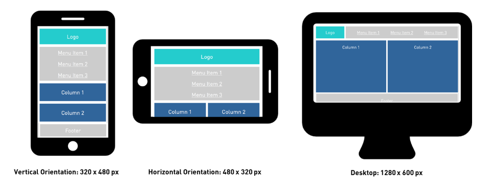

# Lab 2: Web Development Tools and Reponsive Design

You are encouraged to work in pairs for this lab. However **both** partners must submit the files you worked on for credit.  It is totally fine to submit identical files.  Please add a note in the Readme.md file with the utorid of your partner.

In the first part, we'll learn about web development tools for page inspection.

In the second part, we'll take a basic non-responsive website and make it
responsive at two breakpoints with media queries.

Ass with the first lab, you will fork your lab2-UTORID repository (where UTORID) is your UTORID).  Then you will clone it to the machine your are working on, add and commit changes.  When you are ready to submit, you will use `git push origin master` to push the changes to your fork.  Finally, you will navigate to your fork on github.com and use the GUI to make a pull request.

## Part 1: Web Development Tools

1.  Read through the tutorial on web development tools
    [here](http://www.galvanize.com/blog/how-to-use-chrome-devtools-for-the-absolute-beginner/).
2.  Go to this [article](http://www.theonion.com/article/gary-johnson-worried-he-peaking-too-early-after-hi-53996).
3.  Using your browser's Developer Tools, change the headlines to one that
    includes your name in it (be creative but appropriate).
4.  Change the colour of the headlines to a colour that you like. **Bold** and
    *italize* the headlines. [Here's how you can modify a page's styles in
    Chrome's Developer Tools](https://developers.google.com/web/tools/chrome-devtools/iterate/inspect-styles/?hl=en). (An easy way is to just place the correct CSS in the
    `element.style` section) An example would look like the one below.
5.  Take a screenshot and include it in your submission.


## Part 2: Responsive Design

1.  You will edit the code in `index.html`, and the stylesheet located at
    `assets/css/style.css`. Note that we're using semantic elements to get
    comfortable with them for Assignment 1. You may add classes to any element,
    if needed.

2.  Using a **mobile-first** approach, style from the smallest screen to the
    largest according to the mockup images below. Check how your styles render
    at different screen sizes by dragging the browser window to change its size,
    or developer tools (Firefox: Menu > Developer > Responsive Design Mode),
    (Chrome: Menu > More Tools > Developer Tools > Toggle device toolbar
    [at top left]).
    -   Breakpoints: **480px** (smaller screen), **1280px** (large screen); yes,
        we’re skipping a lot!
    -   Notice the order of the breakpoints in `style.css` makes it
        "mobile-first". See an explanation in the comments.
    -   See what [MDN](https://developer.mozilla.org/en/docs/Web/CSS/@media)
        has for an overview of `@media`. Basically in `@media screen`, "screen"
        targets the device (computer, smartphone, ..) screen media types. The
        `and (min-width: 480px)` defines the minimum width to target.

3.  Ensure that the layout and positioning roughly match the mockup images
    below. Some CSS attributes that may be helpful to you to know:
    -   Layout: `box-sizing, text-align, display, float, width, height, ...`
    -   Spacing: `padding, margin, ...`
    -   Coloring: `color, background, ...`
    
    Tips:
    - You may find the [w3schools tutorial](http://www.w3schools.com/css/css_rwd_mediaqueries.asp) useful.  Especially look at the css file in [Try it yourself](http://www.w3schools.com/css/tryit.asp?filename=tryresponsive_col-s).  This example is more complicated than what we are asking you to do, so you don't need to add so many classes to your elements, you can often simply style the elements themselves.
    - You are welcome to choose any background or text colours.  They don't need to match the images below.
    - Don't worry about padding and margins and making it visually match the images below.  The important part is the relative positioning of the elements in as the browser window size changes. After you have the positioning correct, you can add some padding and/or margins to improve the look.
    - The 480x320 size should also include the footer.  It doesn't appear in the image, but you don't need to hide it.
    - Your focus should be on the rearranging of the elements as the browser window size changes.
    - When specifying widths use percentages.




## Advanced (optional)

Many responsive websites hide the main menu and provide a menu button to
show/close the menu for smaller screen sizes. There are a couple of hacky,
non-semantic ways to do this in CSS, but the easiest and most semantic approach
is to use a little bit of JavaScript, such as:

```html
<button id="menu-button">Menu</button>

<!-- ... -->
<script>
document.getElementById('menu-button').addEventListener(
  'click', function() {
    document.getElementById('menu').classList.toggle('open');
  });
</script>
```

**Note:** The `<script>` snippet should be inserted just before the `</body>` tag.

This adds or removes an `open` class on an element with ID `menu` when the
button with ID `menu-button` is clicked.

Style the menu so that it shows/hides based on whether or not the ‘open’
class is applied to it.

Tables are notoriously hard to make responsive, especially on very small screen
sizes (i.e. tablets and smartphones).

Make your table from Lab 1 into a bigger four-column table (and even add some
`<th>` header elements if you’re brave). Using CSS, make your table responsive
on all screens, even those that are 320 pixels in width.


## Deliverables

A pull request on your `lab2-UTORID` repository that contains:

1.  Your screenshot from part 1.
2.  The files that you used for part 2 (`index.html`, `style.css`).


## Attribution

Lab materials based on work by Katie Seaborn.
